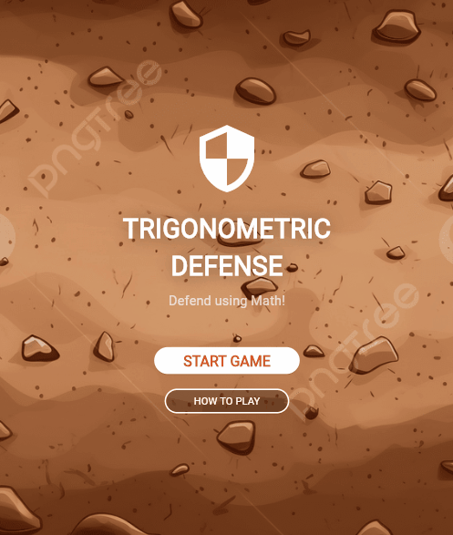

# 🎮 Trigonometric Defence  

**Gamified Learning with Flutter** ✨  
A unique fusion of **mathematics** 📐 and **gameplay** 🎮 designed to make **trigonometric functions** engaging, fun, and unforgettable.  

---

## 🌌 Storyline
You are the **last line of defence** in a vast desert battlefield.  
- The defence system is placed at the **center of a circular field**.  
- Enemies spawn on the **circumference of the circle**.  
- To destroy them, you must use the **power of trigonometric functions** to calculate their positions and distances.  

Each type of enemy belongs to a **specific trigonometric function**:  
- **Sine Army (sin θ)** → swift and numerous.  
- **Cosine Raiders (cos θ)** → balanced and unpredictable.  
- **Tangent Beasts (tan θ)** → powerful but unstable.  

Your mission: **apply the right function at the right time** to protect humanity. 🌍

---

## 🕹️ Gameplay Features
- 🎯 **Math Meets Action** → Every shot is powered by trigonometric calculations.  
- ⚔️ **Function-based Enemy Types** → Each function introduces unique attack patterns.  
- 🚀 **Skill Progression** → As you advance, you master more complex trigonometric strategies.  
- 📊 **Real-Time Feedback** → Learn while playing — mistakes become lessons, victories become knowledge.  
- 🌟 **Gamified Learning** → Designed to strengthen mathematical intuition through fun.  

---

## 🛠️ Tech Stack
- **Flutter** (cross-platform magic ✨)  
- **Dart** (the brain behind the logic)  
- Math Engine with **Trigonometric Functions**  
- Designed for **Android / iOS**  

---

## 🚀 Getting Started

### Prerequisites
- [Flutter SDK](https://flutter.dev/docs/get-started/install) (latest version recommended)  
- Dart installed and configured  
- Android Studio or VS Code with Flutter extension  

### Installation

# Clone the repository
git clone https://github.com/Arash-zihayat/trigonometric-defence.git

# Enter project folder
cd trigonometric-defence

# Get dependencies
flutter pub get

# Run the game
flutter run

---

## 🎬 Demo 

---

## 📈 Roadmap

* [ ] Add multiplayer mode 🔥
* [ ] Unlockable weapons tied to advanced functions
* [ ] Boss fights with composite trigonometric waves
* [ ] Global leaderboard integration 🌍

---

## 🤝 Contributing

Contributions are welcome! 🎉
If you have ideas for new enemy types, gameplay mechanics, or educational features, feel free to:

1. Fork this repo
2. Create your feature branch (`git checkout -b feature/amazing-feature`)
3. Commit changes (`git commit -m 'Add some amazing feature'`)
4. Push to the branch (`git push origin feature/amazing-feature`)
5. Open a Pull Request

---

## 📜 License

This project is licensed under the **MIT License** — feel free to learn, play, and expand!

---

## 👨‍💻 Author

Created with ❤️ by **Arash Zihayat**

* GitHub: [Arash-zihayat](https://github.com/Arash-zihayat)
* LinkedIn: [YourLinkedIn](#)
* Email: [YourEmail](Arashzihayat1249@gmail.com)

